# Sztuczne Sieci Neuronowe

## Release v0.2.0

### Nowości

- Skrypty treningu sieci neuronowych zarówno do regresji, jak i klasyfikacji
- Ilustracje do rozdziału 1.
- Sposoby na ograniczenie overfittingu
- Słownik pojęć technicznych
- Optimizery [?]

## Spis treści

- [Sztuczne Sieci Neuronowe](#sztuczne-sieci-neuronowe)
  - [Release v0.2.0](#release-v020)
    - [Nowości](#nowości)
  - [Spis treści](#spis-treści)
  - [1 Wprowadzenie](#1-wprowadzenie)
    - [1.1 Inspiracja](#11-inspiracja)
    - [1.2 Perceptron](#12-perceptron)
    - [1.3 Funkcje aktywacji](#13-funkcje-aktywacji)
      - [W przeszłości](#w-przeszłości)
      - [ReLU](#relu)
      - [Lista funkcji aktywacji](#lista-funkcji-aktywacji)
    - [1.4 Wielowarstwowy perceptron - sieć głęboka](#14-wielowarstwowy-perceptron---sieć-głęboka)
      - [Budowa](#budowa)
      - [Propagacja w przód](#propagacja-w-przód)
      - [Propagacja w tył (Backpropagation)](#propagacja-w-tył-backpropagation)
      - [Interpretacje sieci głębokich](#interpretacje-sieci-głębokich)
    - [1.5 Istota treningu ANN](#15-istota-treningu-ann)
    - [1.6 Zastosowania](#16-zastosowania)
  - [2 Architektury ANN](#2-architektury-ann)
    - [2.1 Sieci konwolucyjne (Convolutional Neural Network)](#21-sieci-konwolucyjne-convolutional-neural-network)
    - [2.2 Generatywne Sieci Adwersalne (Generative Adversal Network)](#22-generatywne-sieci-adwersalne-generative-adversal-network)
    - [2.3 Sieci Rekurencyjne (Recurrent Neural Network)](#23-sieci-rekurencyjne-recurrent-neural-network)
    - [2.4 Długa Pamięć Krótkoterminowa LSTM (Long Short-Term Memory)](#24-długa-pamięć-krótkoterminowa-lstm-long-short-term-memory)
    - [2.5 GAT](#25-gat)
    - [2.6 Autoenkodery](#26-autoenkodery)
    - [2.7 Transformery](#27-transformery)
      - [2.7.1 Mechanizm atencji](#271-mechanizm-atencji)
      - [2.7.2 Feed forward](#272-feed-forward)
      - [2.7.3 Enkoder](#273-enkoder)
      - [2.7.4 Dekoder](#274-dekoder)
  - [3 Dodatki](#3-dodatki)
    - [3.1 Optimizery](#31-optimizery)
      - [Stochastyczna optymalizacja gradientowa (SGD)](#stochastyczna-optymalizacja-gradientowa-sgd)
      - [SGD z pędem](#sgd-z-pędem)
      - [RMS-prop](#rms-prop)
      - [Adagrad](#adagrad)
      - [AdaDelta](#adadelta)
      - [Adam (Adaptive Moment Estimation)](#adam-adaptive-moment-estimation)
      - [AdamW](#adamw)
    - [3.2 Batch czy mini batch? Czyli o dzieleniu danych treningowych](#32-batch-czy-mini-batch-czyli-o-dzieleniu-danych-treningowych)
      - [Metoda spadku gradientu (batch gradient descent)](#metoda-spadku-gradientu-batch-gradient-descent)
      - [Metoda stochastycznego spadku gradientu (SGD)](#metoda-stochastycznego-spadku-gradientu-sgd)
      - [Mini-batch gradient descent](#mini-batch-gradient-descent)
    - [3.3 Sposoby na ograniczenie overfittingu](#33-sposoby-na-ograniczenie-overfittingu)
      - [Hold-out](#hold-out)
      - [Walidacja krzyżowa](#walidacja-krzyżowa)
      - [Regularyzacja](#regularyzacja)
      - [Dropout](#dropout)
      - [Eliminacja zmiennych nieistotnych](#eliminacja-zmiennych-nieistotnych)
      - [Wzbogacanie danych treningowych (data augmentation)](#wzbogacanie-danych-treningowych-data-augmentation)
      - [Ograniczanie złożoności modelu](#ograniczanie-złożoności-modelu)
      - [Wczesne kończenie treningu](#wczesne-kończenie-treningu)
    - [3.4 XAI](#34-xai)
    - [3.5 Metody treningu z niewielką lub żadną ilością danych](#35-metody-treningu-z-niewielką-lub-żadną-ilością-danych)
    - [3.6 Architektury modeli STT i TTS](#36-architektury-modeli-stt-i-tts)
    - [3.7 Antykruchość, czyli lekcja dla każdego analityka](#37-antykruchość-czyli-lekcja-dla-każdego-analityka)
  - [4 Bibliografia](#4-bibliografia)
  - [5 Słownik pojęć technicznych i anglojęzycznych](#5-słownik-pojęć-technicznych-i-anglojęzycznych)
  
---

## 1 Wprowadzenie

Rozdział ten opowiada o istocie i zasadzie działania sztucznych sieci neuronowych (artificial neural network - ANN). Opisuje ich genezę, budowę, zastosowania we współczesnym świecie i mechanizmy, które zachodzą zarówno podczas trenowania, jak i inferencji modeli opartych o sztuczne sieci neuronowe.

Pytania, na które poznasz odpowiedź w tym rozdziale.

- Jak zbudowane są głębokie sieci neuronowe?
- Na czym polega trening sieci neuronowej?
- Na czym polega trudność w wytrenowaniu sieci neuronowej?
- Jak można interpretować budowę głębokich sieci?

### 1.1 Inspiracja

Bezpośrednią inspiracją dla powstania sztucznych sieci neuronowych (które będę skrótowo odtąd nazywać sieciami neuronowymi lub głębokimi sieciami neuronowymi) jest budowa neuronów w ludzkim mózgu.

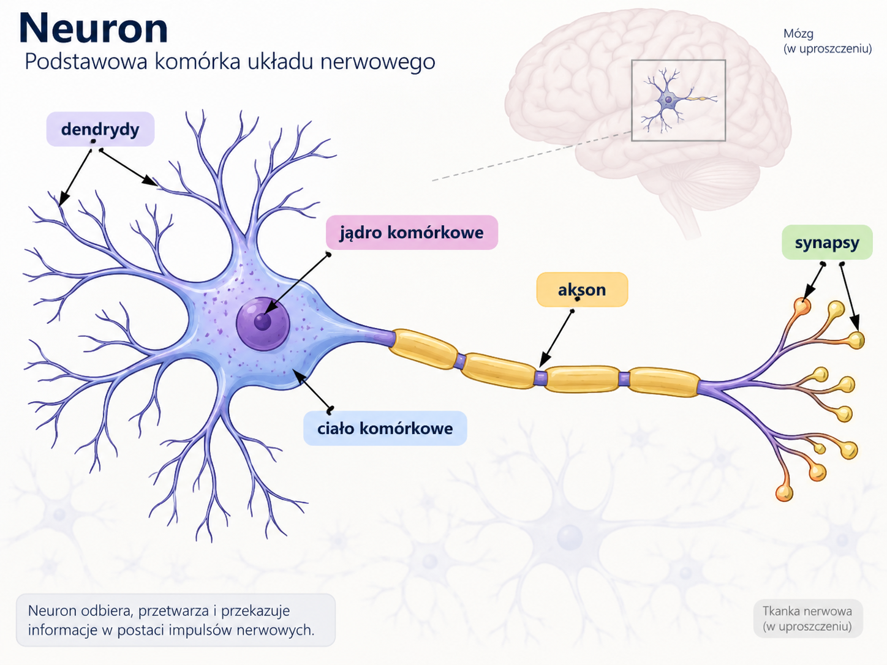

Neurony w mózgu składają się z dendrytów, jądra komórkowego, ciała komórkowego, aksonu i synaps. Dendrydy otrzymują sygnały z sąsiednich neuronów i przekazują je do ciała i jądra komórkowego. Akson przekazuje nowy sygnał do synaps podłączonych do dendrydów innych neuronów. A dalej odbywa się ten sam proces. Sygnały w mózgu przechodzą między neuronami, a w każdym z nich poddawane są indywidualnym procesom transformacji. Z tej obserwacji natury wynikła inspiracja do stworzenia matematycznego modelu neuronu, który musiał jednak przejść wiele uproszczeń. Jakich? Niestety, nie dysponuję dyplomem z neurobiologii, więc pozostawię to do własnych poszukiwań. 

### 1.2 Perceptron

Pierwszymi byli neurofizjolog Warren McCulloch i logik Walter Pitts, którzy w 1943 roku zaproponowali matematyczny model neuronu zwracający zera i jedynki. 15 lat później tę koncepcję dopracował i przedstawił Frank Rosenblatt tworząc perceptron. Perceptron to sztuczny neuron, który oblicza wartość funkcji liniowej, a następnie poddaje ją *pewnej operacji* wprowadzającej nieliniowość. Perceptron ma tyle wejść, co zmiennych w funkcji liniowej plus wyraz wolny zwany w terminologii uczenia maszynowego *bias*'em.

Ta *pewna operacja* odróżnia perceptron od zwyczajnych funkcji liniowych. Bez niej sieci głębokie dałoby się uprościć do funkcji liniowych i nie miałyby żadnego zastosowania. I jest nią funkcja aktywacji.

### 1.3 Funkcje aktywacji

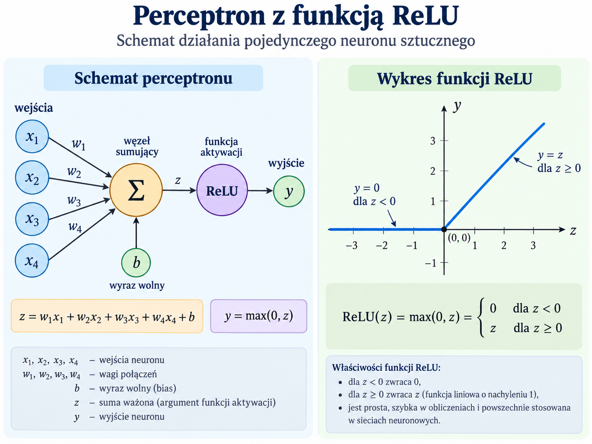
Funkcja aktywacji jest funkcją, która dla wartości funkcji liniowej zwraca nieliniowy sygnał na wyjście. Umożliwia ona odwzorowywanie nieliniowych zależności pomiędzy zmiennymi zależnymi (reprezentowanymi przez neurony warstwy końcowej), a zmiennymi wejściowymi (reprezentowanymi przez neurony w warstwie wejściowej). Dzięki temu ANN-y mogą uczyć się przewidywania nieliniowych zależności.

#### Od perceptronu do współczesności

W przeszłości używano funkcji sigmoidalnych takich jak sigmoid logistyczny i tangens hiperboliczny (tanh). Niestety, badacze zauważyli, że powodują one kilka problemów.

1. Wykazują tendencję do nasycania się, co objawia się tym, że nieważne czy wejście ma dużą wartość, czy większą to zwraca ona bardzo małą pochodną, co straszliwie spowalnia trening, co można zauważyć na dołączonych ilustracjach;
2. Wraz z dokładaniem kolejnych warstw w sieci gradient dla tych funkcji drastycznie szybko zanika;
3. Niewielkie wartości pochodnych dążące do 0 są piętą achillesową dla komputerów. Błędy numeryczne kumulują się wraz z obliczaniem kolejnych warstw, co utrudnia sprawne korygowanie wag.

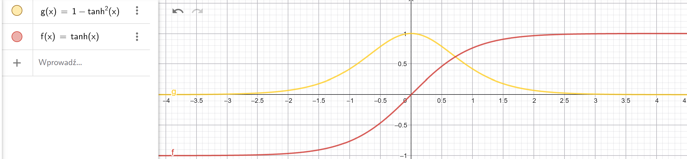
Legenda:

- czerwony kolor: funkcja tangensa hiperbolicznego;
- żółty kolor: pochodna funkcji tangensa hiperbolicznego;

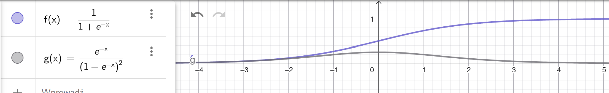
Legenda:

- fioletowy kolor: funkcja sigmoidalna;
- żółty kolor: pochodna funkcji sigmoidalnej;

#### ReLU

Aby rozwiązać oba te problemy zaproponowano funkcję ReLU (Rectified Linear Unit). Uwaga. Od tej pory przestajemy mówić stricte o perceptronach, lecz szerzej o sztucznych neuronach. Funkcja ReLU dla wartości niezerowych jest liniowa, ale dla ujemnych wartości zwraca zero. Dzięki temu nie nasyca się dla wartości dodatnich. Oczywiście są różne wariacje na temat funkcji ReLU, które starają się walczyć z nasyceniem dla wartości ujemnych, ale na początek warto znać kilka podstawowych funkcji aktywacji.

#### Lista funkcji aktywacji

- Tanh

$$
f(x)=\frac{2}{1+e^{-2x}} - 1
$$

- Sigmoid

$$
f(x)=\frac{1}{1+e^{-x}}
$$

- ReLU*

$$
f(x)=max(0, x)
$$

- ELU

$$
f(x)=\begin{cases}
x, & x>0\\
\alpha (e^x-1), & x\le0
\end{cases}
$$

- Leaky ReLU

$$
f(x)=
\begin{cases}
x, & x>0\\
\alpha x, & x\le0
\end{cases}
$$

- SELU

$$
f(x)=\lambda \begin{cases}
x, & x>0\\
\alpha (e^x-1), & x\le0
\end{cases}
$$
$$
\lambda \approx 1.05
\alpha \approx 1.67
$$

- SoftPlus

$$
f(x)=log(1 + e^x)
$$

- Softmax*

$$
f(x_i)=\sigma(x_i)=\frac{e^{x_i}}{\sum_{j=1}^{n} e^{x_j}}
$$

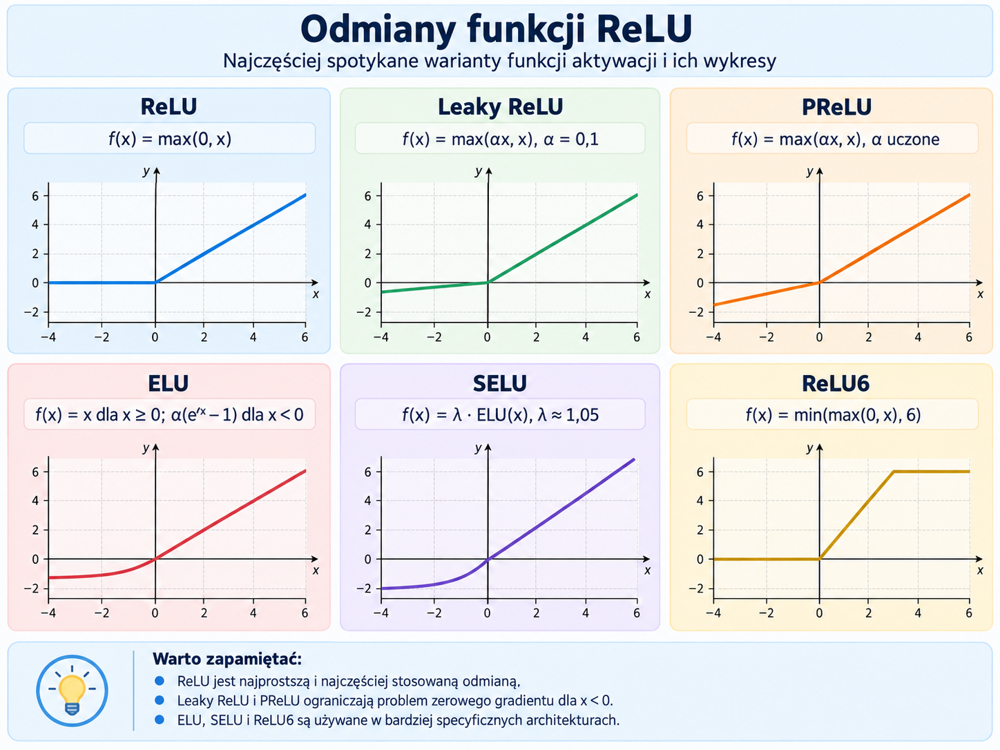

### 1.4 Wielowarstwowy perceptron - sieć głęboka

Sieci zbudowane są z wielu takich perceptronów ułożonych równolegle ze sobą tworząc warstwy sieci. Warstwy sieci z kolei są połączone szeregowo, co czyni je siecią głęboką. Najprostszą postacią sieci głębokiej jest perceptron wielowarstwowy, w skrócie MLP (Multi Layer Perceptron). W dalszej części kompendium pojawi się sieć sprzężenia do przodu (Feedforward Neural Network), która jest w zasadzie tym samym, z tym że nazwa nawiązuje do tego, jak model dokonuje obliczeń.

#### Budowa

Sieć głęboka (MLP) składają się kolejno z:

- warstwy wejściowej (input layer)
- warstw ukrytych (hidden layers)
- warstwy wyjściowej (output layer)

Warstwa wejściowa ma tyle neuronów, ile zmiennych jest wprowadzanych. Jeżeli któraś ze zmiennych jest kategorialna, należy zrzutować ją albo na liczby (jeżeli kategorie są hierarchiczne), albo na wektor zer i jedynek (gdy kategorie są równorzędne), co skutkuje oczywiście zwiększeniem liczby potrzebnych neuronów na początku.

Warstwy ukryte mogą mieć dowolną, niezerową liczbę neuronów. O tym jak liczba neuronów może wpływać na zdolność sieci do prognozowania piszę w tym rozdziale o [tutaj](#interpretacje-sieci-głębokich).

#### Propagacja w przód

Propagacja w przód jest mechanizmem, który pozwala uzyskiwać prognozy po wprowadzeniu do modelu danych wejściowych. Jeśliby spojrzeć na model *z lotu ptaka*, to liczby wprowadzone na wejście są przekazywane DO PRZODU warstwa po warstwie. Sygnał nie jest propagowany ani w kierunku tych samych neuronów w warstwie, ani do tyłu. W innych architekturach np. sieciach rekurencyjnych lub rezydualnych sygnał może być przekazywany od neuronu do neuronu w obrębie warstwy lub może je pomijać.

Warstwa wejścia dostarcza danych liczbowych do neuronów pierwszej warstwy ukrytej. Każdy taki neuron z osobna w warstwie ma własny zestaw wag oraz wyraz wolny, zwany *biasem*, którymi traktuje dane wejściowe. Suma iloczynu skalarnego wektora wag i wektora danych wejściowych oraz wyrazu wolnego po zastosowaniu funkcji aktywacji stanowi sygnał wyjściowy danego neuronu. Sygnał ten następnie jest przekazywany do następnej warstwy oraz ich neuronów i traktowany w ten sam sposób.

$$
n(x) = f(\sum_i{w_i x_i} + b)
$$

Sygnały z ostatniej warstwy ukrytej dochodzą do warstwy wyjściowej.

#### Propagacja w tył (Backpropagation)

Propagacja w tył jest algorytmem, który określa o ile każda z wag powinna się poprawić, aby osiągnąć optimum. Trening sieci neuronowej polega na takim dobraniu wag oraz wyrazów wolnych, żeby model mógł przyswoić wzorce, z pomocą których może poprawnie prognozować. Proces treningu składa się z następujących kroków:

1. Ustaw wagi wstępne w modelu;
2. Użyj danych treningowych do przeprowadzenia propagacji w przód;
3. Wynik z propagacji porównaj z docelowym wynikiem i na jego podstawie oblicz błąd modelu;
4. Na podstawie wielkości błędu oblicz zmianę wag dla każdego neuronu warstwa po warstwie idąc wstecz;
5. Powtórz proces od kroku 2., jeżeli to była ostatnia iteracja lub błąd stał się akceptowalny.

A więc propagacja w tył to nic innego jak przerzucanie błędu modelu od warstwy końcowej na sam początek, a mówiąc bardziej technicznie - propagujemy gradient straty przy użyciu reguły łańcuchowej. Tenże "błąd" można obliczyć korzystając z:

- średniego błędu względnego (MAE);
- błędu średniokwadratowego (MSE);
- binarnej entropii krzyżowej;
- kategorialnej entropii krzyżowej.

Entropia krzyżowa jest używana do zmiennych jakościowych (kategorialnych). Kategorialna entropia wyraża się ona wzorem:

$$
L(y,y')=-\sum_{i=1}^cy_ilog (y'_i)
$$

Gdzie

$y_i$ - Prawdziwa etykieta oznaczająca przynależność do klasy *i*

$y'_i$ - Przewidywane prawdopodobieństwo przynależności do klasy *i*

Aby można było oszacować zmianę wagi, skorzystamy z techniki spadku gradientowego. Gradient jest operacją matematyczną, która określa funkcje pochodne dla każdego argumentu danej funkcji. Pozwala ona wskazać lokalny kierunek najszybszego wzrostu funkcji. Należy obliczyć gradient dla wyjścia modelu oraz przewidywanego wyjścia i odwrócić kierunek w stronę (lokalnego) optimum poprzez odwrócenie znaku. Dla funkcji sigmoidalnej postaci:

$$
f(x)=\frac{1}{1+e^{-x}}
$$

pochodna funkcji to:

$$
\frac{d}{dx}f(x)=f(x)(1-f(x))=\frac{e^{-x}}{(1+e^{-x})^2}
$$

Dla funkcji ReLU:

$$
f(x)=max(0, x)
$$

pochodną funkcji jest:

$$
\frac{d}{dx}f(x)=\begin{cases}
1, & x>0 \\
0, & x\le0
\end{cases}
$$

Oznaczenia:

- $l$ – numer warstwy sieci,
- $L$ – numer ostatniej, wyjściowej warstwy,
- $x$ – wektor danych wejściowych,
- $a^{(0)} = x$ – wejście sieci,
- $W^{(l)}$ – macierz wag połączeń prowadzących do warstwy $l$,
- $b^{(l)}$ – wektor biasów warstwy $l$,
- $z^{(l)}$ – wartości neuronów przed zastosowaniem funkcji aktywacji:
  $$
  z^{(l)} = W^{(l)}a^{(l-1)} + b^{(l)}
  $$
- $a^{(l)}$ – sygnały neuronów po zastosowaniu funkcji aktywacji:
  $$
  a^{(l)} = f^{(l)}(z^{(l)})
  $$
- $f^{(l)}$ – funkcja aktywacji stosowana w warstwie $l$,
- $f'^{(l)}$ – pochodna funkcji aktywacji,
- $\mathcal L$ – funkcja straty,
- $\delta^{(l)}$ – lokalny sygnał błędu/gradientu w warstwie $l$:
  $$
  \delta^{(l)}=\frac{\partial\mathcal L}{\partial z^{(l)}}
  $$
- $\frac{\partial\mathcal L}{\partial W^{(l)}}$ – gradient funkcji straty względem wag warstwy $l$,
- $\frac{\partial\mathcal L}{\partial b^{(l)}}$ – gradient funkcji straty względem biasów warstwy $l$,
- $\eta$ – współczynnik uczenia (learning rate),

$$
a^{(0)}=x
$$
$$
z^{(l)}=W^{(l)}a^{(l-1)}+b^{(l)}
$$
$$
a^{(l)}=f^{(l)}(z^{(l)})
$$
dla warstwy wyjściowej:
$$
\delta^{(L)}
=
\frac{\partial \mathcal L}{\partial z^{(L)}}
$$

Dla warstwy ukrytej zmiany wag oblicza się w następujący sposób:

$$
\delta^{(l)}
=
\left(W^{(l+1)}\right)^T
\delta^{(l+1)}
\cdot
f'^{(l)}(z^{(l)})
$$
gradient wag:
$$
\frac{\partial\mathcal L}{\partial W^{(l)}}
=
\delta^{(l)}
\left(a^{(l-1)}\right)^T
$$
gradient biasu:
$$
\frac{\partial\mathcal L}{\partial b^{(l)}}
=
\delta^{(l)}
$$

i dopiero potem aktualizacja przez prosty gradient descent:

$$
W^{(l)}
\leftarrow
W^{(l)}
-
\eta
\frac{\partial\mathcal L}{\partial W^{(l)}}
$$
$$
b^{(l)}
\leftarrow
b^{(l)}
-
\eta
\frac{\partial\mathcal L}{\partial b^{(l)}}
$$

Współczynnik uczenia określa wielkość kroku wykonywanego przez algorytm korygujący wagi (optimizer). Im mniejszy, tym wolniejszy trening. Im większy, tym większa tendencja do oscylacji i przeskakiwania potencjalnie dobrych obszarów.

#### Interpretacje sieci głębokich

Pierwszą interpretacją, jaką proponuje R. Hurbans w [RHu] jest to, że kolejne warstwy przekształcają reprezentację danych w taką, w której cechy istotne dla zadania stają się łatwiejsze do wykorzystania przez kolejne warstwy, co ułatwia w ostatniej warstwie wskazanie poprawnej prognozy dzięki widocznym cechom.

Drugą interpretacją zaproponowaną w [Wel] jest to, że sieć neuronową odwzorowuje mapa regionów decyzyjnych oddzielonych granicami decyzyjnymi. Im więcej neuronów, tym więcej granic i obszarów, lecz im więcej warstw w sieci, tym więcej takich obszarów i tym mniejszy koszt obliczeniowy. Dobrze oddaje to wzór na maksymalną liczbę regionów:

$$
N = (\frac{D}{D_i} + 1)^{D_i (K-1)}(\frac{D^2+D+2}{2})
$$

Gdzie:

$D_i$ - liczba neuronów w warstwie wejściowej \
$D$ - liczba neuronów na warstwę\
$K$ - liczba warstw pośrednich

Ze wzoru można wywnioskować, że przyrost liczby regionów jest wielomianowy, natomiast ten sam przyrost wywołany zwiększeniem liczby warstw jest wykładniczy. Głębia może umożliwić reprezentowanie pewnych funkcji znacznie bardziej ekonomicznie niż zwiększanie samej szerokości.

Ogólnie rzecz biorąc, ciężko jest stworzyć czytelną i zrozumiałą interpretację modelu dla każdego problemu. Każdy neuron w sieci wykonuje swoje zadanie, które trudno jest opisać jednoznacznie i precyzyjnie. Ale są metody, które pomagają zrozumieć to, jak dana sieć neuronowa dochodzi do rozwiązań. Nimi zajmuje się osobna dziedzina badań - XAI (Explainable AI), dzięki której zyskujemy coraz lepszy wgląd w czynniki wpływające na predykcje i zachowanie modeli, na podstawie którego można oceniać bezpieczeństwo i słuszność w ich podejściu.

### 1.5 Istota treningu ANN

Właściwe ustawienie wag w sieci głębokiej polega na tym, że dla danego zestawu danych treningowych sieć głęboka zwraca minimalną funkcję celu mając nadzieję, że dla nowych danych również zwróci podobnie niewielką. Algorytm propagacji wstecz działa na zasadzie spadku gradientowego. Niestety (dla architektów sieci głębokich) albo na szczęście (bowiem taka jest rzeczywistość) świat jest bardziej skomplikowany niż funkcja liniowa. W przestrzeni rozwiązań dopuszczalnych są rozwiązania, które zwracają zaledwie minima lokalne funkcji błędu, ale jest też co najmniej jedno rozwiązanie, które zwraca minimum globalne. Gradienty mogą zwracać wartości, które niekoniecznie kierują na minimum globalne, lecz na minimum lokalne, co należy brać pod uwagę. Zatem podczas treningu trzeba zwracać uwagę na to, aby kierunek optymalizacji dążył do wytrenowania takich parametrów, które nie tylko dają dostatecznie małą funkcję celu, ale również dobrą generalizację.

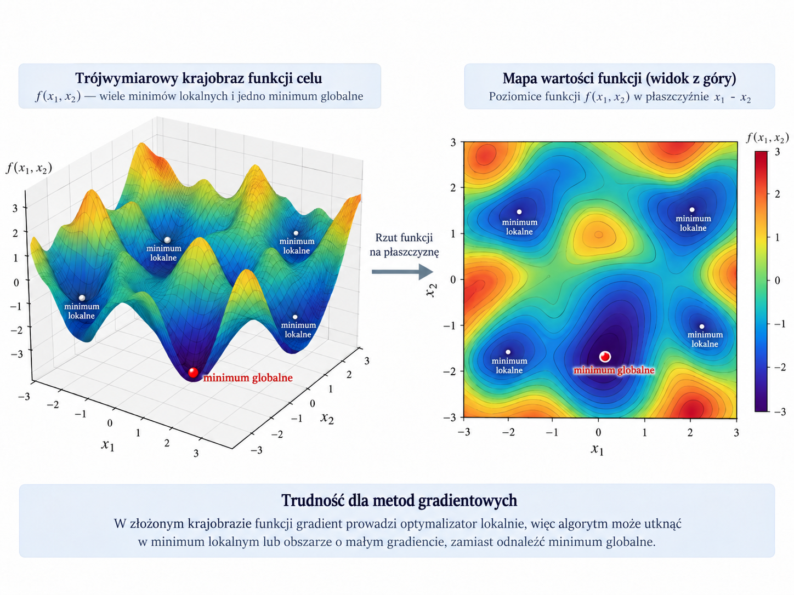

Można to uprawdopodobnić na wiele sposobów. Na przykład podczas inicjalizacji wag losuje się kilka lub więcej zestawów, a następnie dokonuje się selekcji takiego zestawu, który pozwoli na potencjalnie najbardziej jakościowy trening.

Klasyczny algorytm stochastycznego spadku gradientowego wzbogaca się innymi metodami, które na różnych etapach treningu promują bardziej eksplorację, niż eksploatację przestrzeni rozwiązań i vice versa. Jedne metody robią to poprzez modyfikację współczynnika $\lambda$, który odpowiada za wielkość kroku (wyżarzanie kosinusowe). A inne robią to poprzez m.in. szacowanie pędów (momentów) gradientów (rodzina algorytmów Adam).

Kolejną sprawą jest zapobieganie przesadnemu dopasowaniu modelu do danych treningowych. Objawia się to tym, że dla danych treningowych model bardzo trafnie przewiduje wyniki, zaś dla danych spoza tego zbioru model cechuje się gorszą jakością predykcji, która w skrajnych sytuacjach będzie mniej lub bardziej podobna do zgadywania. W terminologii, która bardzo wiele zawdzięcza światu anglosaskiemu, nazywa się to **overfittingiem**. O sposobach na zapobieganie mu [piszę tutaj](#32-batch-czy-mini-batch-czyli-o-dzieleniu-danych-treningowych).

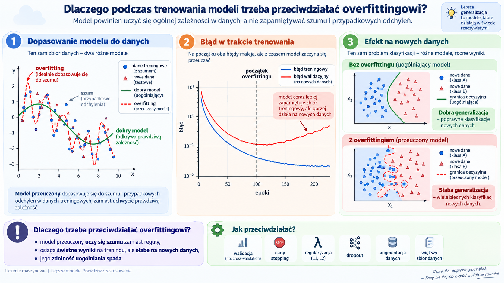

### 1.6 Zastosowania

Sztuczne sieci neuronowe stosuje się m.in. do:

- szacowania przyszłych cen akcji na giełdzie;
- oceny ryzyka kredytowego;
- tłumaczenia tekstów na obce języki;
- wspomaganie analizy obrazów medycznych, np. RTG;
- analizy sentymentu na podstawie wpisów w Internecie;
- generowania muzyki
- generowania filmów i obrazów
- wspomagania podejmowania decyzji w złożonych środowiskach operacyjnych

## 2 Architektury ANN

Pytania, na które poznasz odpowiedź w tym rozdziale.

- Jak sieci głębokie rozpoznają ludzi i przedmioty na zdjęciach?
- Jak działają współczesne LLM-y, które ułatwiają nam życie?
- Na czym polega proces generowania deepfake'ów?

### 2.1 Sieci konwolucyjne (Convolutional Neural Network)

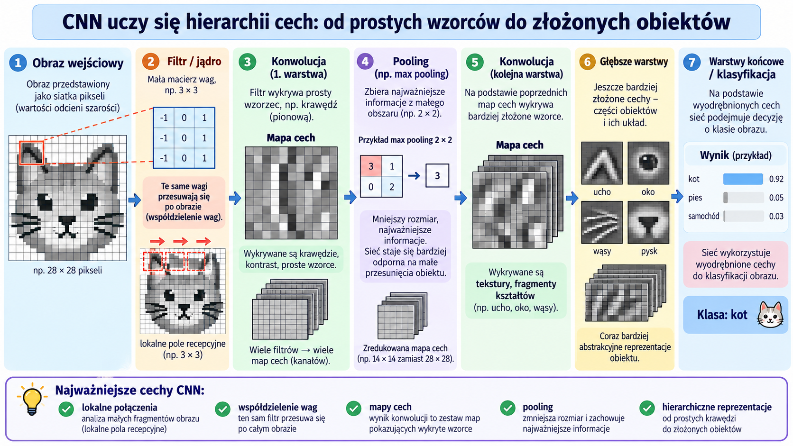

Sieci konwolucyjne (CNN) to rodzaj sieci neuronowych zaprojektowany do pracy z danymi posiadającymi **lokalną strukturę**, takimi jak obrazy, sygnały czy szeregi czasowe. Szczególnie dobrze sprawdzają się tam, gdzie istotna jest relacja pomiędzy sąsiadującymi elementami danych — na przykład pomiędzy pobliskimi pikselami obrazu.

Podstawowym mechanizmem wykorzystywanym przez CNN jest **konwolucja**, nazywana również splotem. Polega ona na przesuwaniu niewielkiego **filtra (jądra, kernela)** po danych wejściowych. W każdej pozycji wartości filtra są mnożone przez odpowiadające im wartości fragmentu wejścia, a otrzymane iloczyny są następnie sumowane. Wynik tej operacji tworzy nową reprezentację danych nazywaną **mapą cech** (*feature map*). Ściśle rzecz biorąc, operacja stosowana w większości implementacji CNN jest matematycznie korelacją krzyżową, jednak w kontekście sieci neuronowych zwyczajowo określa się ją mianem konwolucji.

Filtr można traktować jako niewielki **detektor określonego wzorca**. Ten sam zestaw wag jest stosowany w różnych miejscach wejścia, dlatego filtr może reagować na podobną cechę pojawiającą się w różnych częściach obrazu. Pierwsze warstwy sieci uczą się zazwyczaj prostych cech, takich jak krawędzie, kierunki czy zmiany kontrastu. Kolejne warstwy mogą łączyć je w coraz bardziej złożone reprezentacje — tekstury, fragmenty kształtów, części obiektów, a ostatecznie struktury przydatne do rozwiązania konkretnego zadania.

Pomiędzy warstwami konwolucyjnymi mogą występować również warstwy **poolingu**, których zadaniem jest zmniejszenie przestrzennych rozmiarów reprezentacji. Przykładowo **max pooling** wybiera największą wartość z niewielkiego obszaru, natomiast **average pooling** oblicza jego średnią. Pooling nie służy więc bezpośrednio do wybierania „najważniejszych cech”, lecz przede wszystkim do **kompresowania reprezentacji**, zwiększania pola recepcyjnego kolejnych warstw oraz ograniczania wrażliwości modelu na niewielkie przesunięcia cech w danych.

W przeciwieństwie do klasycznej warstwy w pełni połączonej, neuron warstwy konwolucyjnej **nie analizuje od razu całego obrazu**. Otrzymuje jedynie informacje z niewielkiego lokalnego obszaru. Ponadto te same wagi filtra są współdzielone w wielu miejscach wejścia. Dzięki temu sieci konwolucyjne wykorzystują znacznie mniej parametrów niż analogiczne sieci w pełni połączone i zachowują informację o przestrzennej strukturze danych.

Trening CNN polega między innymi na **uczeniu wartości wag filtrów**. Nie projektujemy więc ręcznie filtrów odpowiedzialnych np. za wykrywanie krawędzi, oczu czy określonych dźwięków. Podczas uczenia, za pomocą propagacji wstecznej i algorytmu optymalizacyjnego, sieć sama dostosowuje wartości filtrów tak, aby uzyskiwane przez nią reprezentacje były przydatne do minimalizacji funkcji straty. W ten sposób może nauczyć się cech potrzebnych między innymi do klasyfikacji obrazów, rozpoznawania mowy czy analizy sygnałów.

Jedną z najważniejszych historycznie sieci konwolucyjnych był **AlexNet**, zaprezentowany przez Alexa Krizhevsky'ego, Ilyę Sutskevera i Geoffreya Hintona w 2012 roku. Model osiągnął przełomowy wynik w konkursie **ImageNet Large Scale Visual Recognition Challenge (ILSVRC)** w zadaniu klasyfikacji obrazów, znacząco przewyższając wcześniejsze rozwiązania i przyczyniając się do gwałtownego wzrostu zainteresowania głębokimi sieciami neuronowymi. AlexNet zawierał **5 warstw konwolucyjnych i 3 warstwy w pełni połączone**. Warstwy konwolucyjne odpowiadały za tworzenie hierarchicznych reprezentacji obrazu, natomiast końcowe warstwy wykorzystywały te reprezentacje do klasyfikacji obrazu do jednej z 1000 klas.

### 2.2 Generatywne Sieci Adwersalne (Generative Adversal Network)

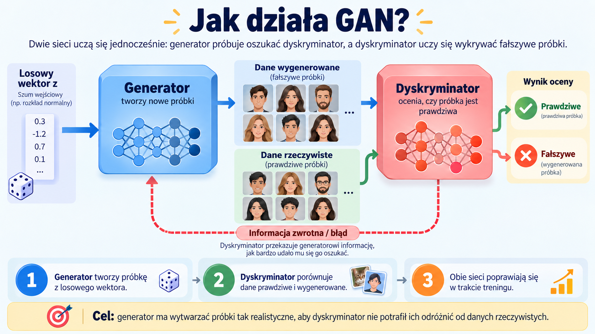

Generatywne sieci adwersalne (GAN) to architektury składające się z dwóch sieci neuronowych uczonych jednocześnie: **generatora** i **dyskryminatora**. Generator otrzymuje na wejściu zwykle losowy wektor i próbuje na jego podstawie tworzyć nowe próbki przypominające dane treningowe, np. obrazy twarzy. Dyskryminator natomiast otrzymuje zarówno dane prawdziwe, jak i wygenerowane, a jego zadaniem jest rozpoznanie, które z nich pochodzą ze zbioru treningowego. GAN nie jest więc pojedynczą siecią „rysującą obrazy”, lecz układem dwóch konkurujących ze sobą modeli, z których jeden uczy się **generować**, a drugi **oceniać autentyczność** wygenerowanych danych.

Uczenie GAN można rozumieć jako **grę adwersaryjną**. Dyskryminator jest optymalizowany tak, aby coraz skuteczniej odróżniał dane prawdziwe od sztucznych, natomiast generator — aby coraz skuteczniej wprowadzał dyskryminator w błąd. W miarę treningu generator dostaje pośrednią informację zwrotną o tym, jakie cechy danych powodują, że jego próbki wyglądają wiarygodnie, i stopniowo uczy się przybliżać rozkład danych treningowych. W idealnym przypadku dochodzi do stanu, w którym próbki generatora są na tyle podobne statystycznie do rzeczywistych, że dyskryminator nie potrafi ich niezawodnie rozróżnić.

GAN-y mogą generować bardzo realistyczne obrazy, modyfikować styl danych, zwiększać rozdzielczość obrazów czy tworzyć syntetyczne przykłady do augmentacji zbiorów treningowych. Ich uczenie jest jednak trudniejsze niż klasyczne trenowanie pojedynczej sieci, ponieważ poprawa jednego modelu stale zmienia problem rozwiązywany przez drugi. Typowymi problemami są **niestabilność treningu** oraz **mode collapse**, w którym generator produkuje tylko niewielką liczbę podobnych typów przykładów zamiast odwzorowywać pełną różnorodność danych. Z tego powodu opracowano wiele odmian GAN-ów, takich jak **DCGAN, WGAN, CycleGAN czy StyleGAN**, które modyfikują architekturę lub funkcję celu, aby poprawić stabilność i jakość generowanych danych.

### 2.3 Sieci Rekurencyjne (Recurrent Neural Network)

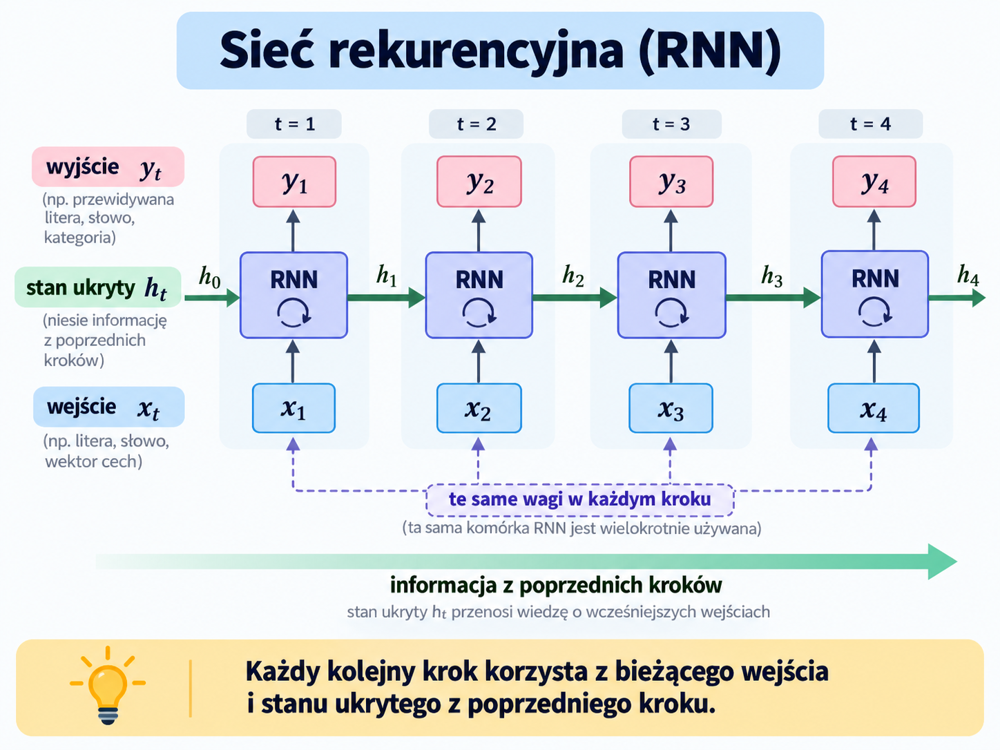

Sieci rekurencyjne (Recurrent Neural Networks, RNN) to rodzaj sieci neuronowych przeznaczonych przede wszystkim do przetwarzania danych sekwencyjnych, czyli takich, w których kolejność elementów ma znaczenie. Mogą to być na przykład szeregi czasowe, tekst, sygnały dźwiękowe czy sekwencje pomiarów. W przeciwieństwie do klasycznej sieci feedforward, która traktuje każde wejście niezależnie, RNN utrzymuje stan ukryty (hidden state) zawierający informację o wcześniej przetworzonych elementach sekwencji. Dla kolejnego elementu wejściowego sieć korzysta więc zarówno z aktualnych danych, jak i ze swojego wcześniejszego stanu.

Mechanizm ten można wyobrazić sobie jako wielokrotne używanie tej samej warstwy dla kolejnych elementów sekwencji. W chwili $t$ sieć oblicza nowy stan $h_t$ na podstawie aktualnego wejścia $x_t$ oraz poprzedniego stanu $h_{t-1}$. Te same parametry są współdzielone pomiędzy kolejnymi krokami czasowymi, dzięki czemu długość sekwencji nie musi być z góry ustalona. Podczas uczenia sieć można „rozwinąć w czasie”, a gradienty propagować przez kolejne kroki za pomocą backpropagation through time (BPTT).

Problemem klasycznych RNN jest trudność w uczeniu się zależności obejmujących wiele kroków sekwencji. Podczas propagacji gradientów wielokrotne mnożenie przez te same macierze może prowadzić do zanikania gradientu lub jego eksplozji. W efekcie zwykła RNN często dobrze wychwytuje zależności lokalne, ale może mieć problem z zapamiętaniem informacji sprzed kilkudziesięciu czy kilkuset kroków. RNN nie należy więc rozumieć jako sieci posiadającej trwałą pamięć całej historii — jej stan jest raczej skompresowanym, stale aktualizowanym opisem dotychczasowej sekwencji.

### 2.4 Długa Pamięć Krótkoterminowa LSTM (Long Short-Term Memory)

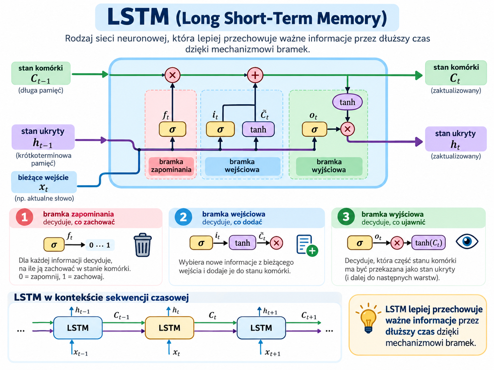

LSTM (Long Short-Term Memory) jest szczególnym rodzajem sieci rekurencyjnej zaprojektowanym tak, aby skuteczniej przechowywać informacje przez długie fragmenty sekwencji. Nie jest to zatem konkurencyjna wobec RNN rodzina sieci, lecz jej bardziej rozbudowany wariant. Najważniejszą zmianą jest wprowadzenie dodatkowego stanu komórki $c_t$, który tworzy stosunkowo bezpośrednią ścieżkę przepływu informacji przez kolejne kroki czasowe. Dzięki temu istotne informacje mogą być zachowywane znacznie dłużej niż w klasycznej RNN.

Przepływem informacji zarządzają specjalne mechanizmy nazywane bramkami. Bramka zapominania (forget gate) określa, jaka część dotychczasowej informacji powinna zostać usunięta, bramka wejściowa (input gate) decyduje, jakie nowe informacje mają zostać zapisane, natomiast bramka wyjściowa (output gate) kontroluje, jaka część stanu komórki wpłynie na aktualny stan ukryty i wyjście sieci. Wartości bramek są wyznaczane przez samą sieć podczas uczenia, dzięki czemu model może nauczyć się, kiedy informacje należy zapamiętywać, a kiedy ignorować.

Tak skonstruowany mechanizm znacznie ogranicza problem zanikania gradientu i pozwala modelować długoterminowe zależności w danych, dlatego LSTM przez wiele lat były podstawowym narzędziem m.in. w przetwarzaniu języka, rozpoznawaniu mowy i analizie szeregów czasowych. Nie oznacza to jednak, że LSTM posiada nieograniczoną lub symboliczną pamięć — nadal przechowuje informacje w wektorach o ustalonym rozmiarze i może tracić szczegóły bardzo długich sekwencji. Jest również bardziej złożona obliczeniowo od klasycznej RNN ze względu na większą liczbę parametrów i operacji wykonywanych w każdym kroku czasowym.

### 2.5 GAT

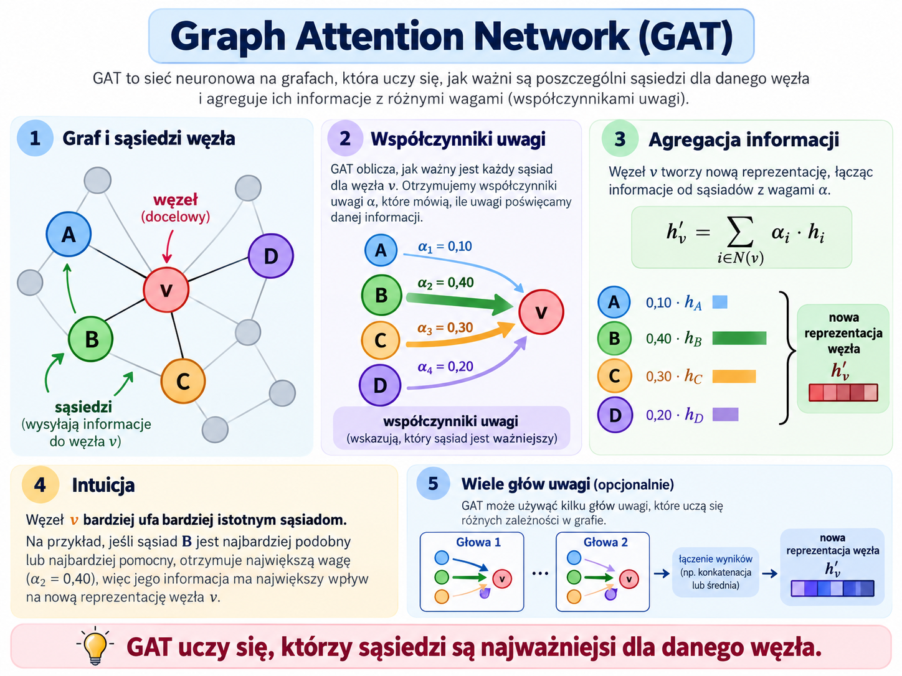

Graph Attention Networks (GAT) należą do grafowych sieci neuronowych (Graph Neural Networks, GNN) i służą do przetwarzania danych reprezentowanych w postaci grafu. Graf składa się z węzłów oraz łączących je krawędzi — może więc reprezentować na przykład sieć społecznościową, cząsteczkę chemiczną, sieć transportową czy zbiór powiązanych dokumentów. W przeciwieństwie do sieci operujących na regularnych strukturach, takich jak obrazy lub sekwencje, GAT nie zakłada stałej liczby ani uporządkowania sąsiadów każdego elementu.

Podstawą działania GAT jest mechanizm attention, za pomocą którego węzeł ocenia znaczenie informacji pochodzącej od swoich sąsiadów. Dla każdego połączenia wyznaczany jest współczynnik uwagi określający, jak silnie cechy danego sąsiada powinny wpłynąć na nową reprezentację rozpatrywanego węzła. Następnie reprezentacje sąsiadów są ważone tymi współczynnikami i agregowane. Często stosuje się jednocześnie kilka niezależnych mechanizmów uwagi, czyli multi-head attention, pozwalających analizować relacje między węzłami na różne sposoby.

GAT nie należy jednak utożsamiać z Transformerem tylko dlatego, że obie architektury wykorzystują attention. W typowej warstwie GAT uwaga jest ograniczona przede wszystkim do węzłów połączonych krawędziami grafu, dzięki czemu sam graf określa, pomiędzy którymi elementami może następować wymiana informacji. Kolejne warstwy pozwalają stopniowo zwiększać zasięg tej komunikacji — po jednej warstwie węzeł otrzymuje informacje od bezpośrednich sąsiadów, po dwóch również pośrednio od sąsiadów drugiego rzędu itd. Dzięki temu GAT może uczyć się jednocześnie cech poszczególnych obiektów oraz znaczenia relacji zachodzących między nimi.

### 2.6 Autoenkodery

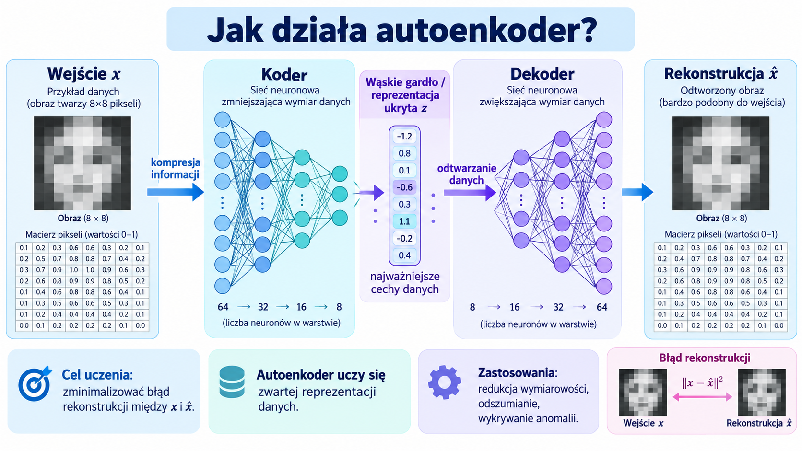

Autoenkodery (ang. autoencoders) to sieci neuronowe uczące się kompresować dane do zwartej reprezentacji, a następnie odtwarzać z niej dane wejściowe. Typowy autoenkoder składa się z dwóch części: enkodera, który przekształca wejście $x$ w reprezentację ukrytą $z$, oraz dekodera, który na podstawie $z$ rekonstruuje przybliżenie wejścia $\hat{x}$. Uczenie polega na minimalizacji błędu rekonstrukcji, czyli różnicy pomiędzy $x$ i $\hat{x}$. W przeciwieństwie do klasyfikatora autoenkoder nie musi przewidywać zewnętrznej etykiety — jego celem jest nauczenie się takiej reprezentacji danych, która zachowuje informacje potrzebne do ich odtworzenia.

Najważniejszym elementem jest zwykle wąskie gardło (bottleneck), czyli reprezentacja ukryta o mniejszej liczbie wymiarów lub w inny sposób ograniczonej pojemności. Ograniczenie to zmusza sieć do wydobywania istotnych struktur i zależności zamiast prostego kopiowania wejścia. Przykładowo, autoenkoder uczony na obrazach twarzy może w reprezentacji ukrytej kodować cechy związane z kształtem twarzy, oświetleniem czy położeniem elementów obrazu, pomijając część mniej istotnych szczegółów. Autoenkoder nie jest jednak po prostu algorytmem kompresji plików — jego reprezentacja jest uczona na podstawie statystycznej struktury konkretnego zbioru danych i ma przede wszystkim umożliwiać dobrą rekonstrukcję przykładów podobnych do tych obserwowanych podczas treningu.

Po nauczeniu autoenkodera jego reprezentacja ukryta może być wykorzystana do redukcji wymiarowości, ekstrakcji cech, usuwania szumu czy wykrywania anomalii. W tym ostatnim przypadku model uczony na danych typowych zazwyczaj dobrze je rekonstruuje, natomiast nietypowe obserwacje mogą powodować większy błąd rekonstrukcji. Istnieją również bardziej wyspecjalizowane odmiany, takie jak denoising autoencoders, uczone do odtwarzania czystych danych z zaszumionego wejścia, oraz wariacyjne autoenkodery (VAE), które uczą uporządkowanej probabilistycznej przestrzeni ukrytej i mogą służyć do generowania nowych przykładów.

### 2.7 Transformery

#### 2.7.1 Mechanizm atencji

#### 2.7.2 Feed forward

#### 2.7.3 Enkoder

#### 2.7.4 Dekoder

### 2.8 Modele dyfuzyjne

## 3 Dodatki

Pytania, na które poznasz odpowiedź w tym rozdziale.

- Czym różnią się od siebie algorytmy modyfikujące wagi (optimizery)?
- Jak skutecznie zapobiegać overfittingowi?
- Jak komputer potrafi rozpoznać mowę człowieka?

### 3.1 Optimizery

#### Stochastyczna optymalizacja gradientowa (SGD)

#### SGD z pędem

#### RMS-prop

#### Adagrad

#### AdaDelta

#### Adam (Adaptive Moment Estimation)

#### AdamW

### 3.2 Batch czy mini batch? Czyli o dzieleniu danych treningowych

Istnieją różne podejścia w przekazywaniu danych podczas pętli treningowej. Można podawać cały komplet, w oparciu o który model ustawia swoje wagi. Można podawać je pojedynczo, albo partiami liczącymi po kilka przykładów. Poniżej opisuję ich wady oraz zalety, które warto znać.

#### Metoda spadku gradientu (batch gradient descent)

Polega ona na obliczaniu nowych wag po przeprocesowaniu całego zbioru treningowego. Pozwala ona uzyskiwać dokładne poprawki, które są uśrednione dla całego zbioru treningowego. Wyróżnia się dodatkowo stabilnością, przez którą funkcja straty jest malejąca, co widać na wykresie spadku straty. Wadą jest pamięciożerność oraz czasochłonność, gdyż model musi obliczać w każdej epoce predykcje dla wszystkich przykładów.

#### Metoda stochastycznego spadku gradientu (SGD)

Metoda stochastyczna polega na obliczaniu nowych wag przy użyciu tylko jednej obserwacji ze zbioru treningowego.

Dzięki temu pętla treningowa zużywa mniej pamięci, ponieważ trzeba przechowywać mniej predykcji w każdej iteracji. Ta metoda jest też o wiele szybsza. Pozwala ona unikać minimów lokalnych. Świetnie nadaje się zarówno do ogromnych zbiorów danych, jak i systemów chmurowych, a także do urządzeń brzegowych (IoT, telefony, tablety).

Metoda ta za sprawą swoich zalet ma następujące wady. Po pierwsze, trening jest niestabilny, gdyż wagi są gwałtownie zmieniane, a informacja z poprzednich iteracji może zostać zatracona. Po drugie, model podczas treningu wykazuje wysokie tendencje do oscylowania wokół docelowego minimum.

Aby ta metoda była skuteczna, należy przed każdą epoką losować kolejność podawania danych treningowych.

#### Mini-batch gradient descent

Rozwiązaniem kompromisowym jest dzielenie zbioru treningowego na porcje danych liczące po kilka lub więcej obserwacji. To podejście pozwala zarówno ustabilizować trening, jak i zachować zalety poprzedniej metody takie jak unikanie minimów lokalnych. Jest szeroko wykorzystywana do trenowania ogromnych modeli przy użyciu dużych zbiorów danych.

Jednakże, aby wykorzystać pełen potencjał tej metody, należy próbować różnych rozmiarów tych batch'y (porcji danych). Zaleca się, aby liczba ta była potęgą dwójki, aby móc optymalnie wykorzystywać zasoby obliczeniowe kart graficznych. Można zacząć próbować od wielkości 16 lub 32 obserwacji.

### 3.3 Sposoby na ograniczenie overfittingu

#### Hold-out

Hold-out polega na dzieleniu zbioru danych na podzbiór treningowy i testowy. W praktyce często wyznacza się też osobny zbiór walidacyjny, który pozwala na bieżąco oceniać postęp treningu po każdej epoce.

Dzięki temu podziałowi można w banalny sposób ocenić, czy model jest nadmiernie dopasowany, czy nie. Wystarczy spojrzeć na metryki dokładności i stwierdzić, czy dla zbioru testowego są one istotnie mniejsze, niż dla zbioru treningowego. Jeżeli tak, to model jest nadmiernie dopasowany. Jeżeli nie, to oznacza, że model umie generalizować.

Należy przy tym uważać na *wycieki danych*, czyli sytuacje gdzie do danych treningowych dostają się informacje, które w nieuprawniony sposób ułatwiają modelowi przewidywania czyli m.in. obserwacje ze zbioru testowego, charakterystyczne sygnatury na zdjęciach lub w nagraniach, które pasują do prawidłowych etykiet

#### Walidacja krzyżowa

Polega ona na dzieleniu danych na równe fragmenty, zwykle 3, 5 lub więcej i trenowaniu modelu na różnych kombinacjach tych fragmentów. Do testowania używa się jednego fragmentu, a do treningu pozostałych. Proces wybierania i trenowania na kolejnych kombinacjach fragmentów jest powtarzany tyle razy, ile jest fragmentów (skąd pochodzi jego nazwa).

Dzięki temu można dobrać taką konfigurację danych treningowych, która buduje najlepszy model ze wszystkich dostępnych konfiguracji. Niestety, dla modeli opartych o głębokie sieci neuronowe jest ona zbyt kosztowna.

#### Regularyzacja

Regularyzacja to technika polegające na obciążaniu funkcji straty dodatkowymi karami za wagi, które zwiększają złożoność modelu i utrudniają generalizację. Wyróżnia się dwie techniki:

- L1 (tzw. lasso)
- L2 (tzw. ridge)

Pierwsza technika dodaje do funkcji kary sumę ***wartości bezwzględnych*** każdej wagi zmodyfikowaną o hiperparametr $\lambda$. Dzięki temu można wyzerować najmniej znaczące wagi, co istotnie upraszcza model. Metoda ta jest odporna na obserwacje odstające (outlier'y).

$$
f'_{kara}(w) = f_{kara}(w)+\lambda \cdot \sum{|w_{i}|}
$$

Druga technika polega na dodaniu sumy kwadratów wag zmodyfikowaną też o hiperparametr $\lambda$. Dodanie jej sprawia, że wagi modelu będą oscylowały wokół zera, ale go nie osiągną. Technika ta pozwala modelowi nauczyć się złożonych schematów, które pozwolą poprawnie przewidywać wynik. Niestety, ta metoda nie jest odporna na obserwacje odstające.

$$
f'_{kara}(w) = f_{kara}(w)+\lambda \cdot \sum{w_{i}^2}
$$

W praktyce najczęściej stosuje się metodę L2, ale nic nie stoi na przeszkodzie, aby stosować je jednocześnie.
$$
f'_{kara}(w) = f_{kara}(w)+\lambda_1 \cdot \sum{|w_{i}|}+\lambda_2 \cdot \sum{w_{i}^2}
$$

#### Dropout

Polega na losowym zerowaniu wag podczas treningu we wskazanej warstwie lub warstwach. Sterowanie polega na określeniu prawdopodobieństwa, z jakim dowolna waga zostanie wyzerowana po skorygowaniu wag. Dzięki temu model unika overfittingu poprzez uczenie się wzorców w bardziej rozproszony sposób, a także staje się prostszy, lecz na osiągnięcie pełnej konwergencji model potrzebuje więcej epok.

#### Eliminacja zmiennych nieistotnych

Podczas pracy analitycznej nie wszystkie zmienne są potrzebne. Aby móc wskazać, które są nieistotne, można posłużyć się różnymi sposobami. Poniżej wymieniam te najważniejsze:

- Macierz korelacji
- Analiza wariancji
- Dwuczynnikowa analiza wariancji (ANOVA)
- Test niezależności Chi-kwadrat
- Eliminacja wsteczna

Macierz korelacji pozwala określić, które zmienne są nieskorelowane ze sobą, a które są zbyt mocno skorelowane. Jeżeli dwie zmienne, które mają określać zmienną zależną, są ze sobą silnie skorelowane, to należy odrzucić jedną z nich. Jeżeli któraś ze zmiennych jest najsłabiej skorelowana ze zmienną zależną, to tą też należy odrzucić.

Analiza wariancji jest wglądem w to, czy zmienna ma za małą wariancję. Jest to bardzo ważne, bowiem bez odpowiednio dużej wariancji nie ma mowy o poprawnej predykcji. Wynika to pośrednio z twierdzenia FWL, gdyż zmienna będąca praktycznie stałowartościowa stworzy model regresji o idealnej współliniowości ze zmienną zależną. Z matematycznego punktu widzenia zerowa wariancja uniemożliwia stworzenie współczynnika kierunkowego $\beta$, a numerycznie wartość wariancji oscylującej wokół zera komplikuje budowę modelu.

$$\beta = \frac{Cov(X_1,X_2)}{Var(X_1)}$$

Dwuczynnikowa analiza wariancji jest testem pozwalającym stwierdzić, czy zmienna numeryczna ma wpływ na zmienną objaśnianą. Zwraca ona wartość testu i wartość p (*p-value*). Istotność zmiennej określa się na podstawie tego, czy wartość p nie przekracza progu 0.05. W zasadzie to są trzy progi:

- 0.001 - poniżej tego progu zmienna ma duży wpływ na zmienną objaśnianą;
- 0.01 - poniżej tego progu zmienna ma co najmniej umiarkowany wpływ;
- 0.05 - poniżej tego progu zmienna ma co najmniej istotny wpływ;

Test ANOVA pozwala też badać wpływ zmiennej kategorialnej, o ile ma co najmniej trzy kategorie. Jeżeli zmienna kategorialna nie ma rozkładu normalnego, to stosuje się test Kruskala-Wallisa dla kategorii niezależnych, a dla zależnych test Friedmana.

Poniżej tej liczby stosuje się test t-Studenta. Jeżeli zmienna objaśniająca nie ma rozkładu normalnego to stosuje się test Manna-Whiteneya dla kategorii niezależnych lub test Wilcoxona dla kategorii zależnych od siebie.

Test niezależności Chi-kwadrat sprawdza, czy zmienna kategorialna ma wpływ na zmienną objaśnianą (która też jest kategorialna). Tak samo jak w teście ANOVA bada się jego istotność i porównuje się ww. progami. Należy przedtem sprawdzić, czy kategorie w zmiennych są zależne od siebie. Jeśli tak, to należy zaniechać używania tego testu i użyć takiego, który będzie pasować.

Jeżeli zmienna objaśniająca jest numeryczna, a objaśniana jest zmienną kategorialną, to dla nich buduje się model regresji logistycznej i bada się jego metryki.

Eliminacja wsteczna jest metodą, która polega na budowaniu modelu, sprawdzaniu metryk i iteracyjnym odrzucaniu najmniej istotnych zmiennych.

#### Wzbogacanie danych treningowych (data augmentation)

Ta technika polega na wprowadzaniu do zbioru danych treningowych artefaktów, które w praktycznym zastosowaniu mogłyby zaburzać pracę, ale podczas treningu uodporniają model na anomalie otrzymane na wejściu. Sprowadza się to do dodawania mniej lub bardziej regularnych szumów do danych treningowych, zakrywania części obrazu i innych manipulacji na danych, które mogą być przypadkowe lub zamierzone przez stronę atakującą dany model.

Technika ta jest szeroko stosowana w modelach wizji komputerowej, gdyż pozwala ona uodpornić model na zakłócenia pracy kamery oraz poprawić zdolność modelu do generalizacji.

#### Ograniczanie złożoności modelu

Polega to na redukcji neuronów w określonych warstwach lub usuwaniu całych warstw w sieci neuronowej. Ma to na celu zmniejszyć złożoność modelu i poprawić wyniki inferencji.

#### Wczesne kończenie treningu

Polega to na kończeniu treningu wtedy, gdy metryki wskazują na to, że dalszy trening nie umożliwi istotnego poprawienia wag modelu, a jednocześnie dalszy trening spowoduje nadmierne dopasowanie do danych treningowych.

### 3.4 XAI

SHAP, LIME, wykresy PDP, ICE, testy ANOVA jedno i dwukierunkowe

### 3.5 Metody treningu z niewielką lub żadną ilością danych

### 3.6 Architektury modeli STT i TTS

CNN, RNN i Transformery

### 3.7 Antykruchość, czyli lekcja dla każdego analityka

## 4 Bibliografia

1. [Rhu] R. Hurbans. Grokking Artificial Intelligence Algorithms. Manning Publications Co. Rok wydania 2020. ISBN: 978-16-172-9618-5
2. L. Tunstall, L. von Werra, T. Wolf. Przetwarzanie języka naturalnego z wykorzystaniem transformerów. Helion S.A. 2024. ISBN: 978-83-289-0711-9
3. D. Chuan-En-Lin. 8 Simple Techniques to Prevent Overfitting, [online]. Dostęp w Internecie: <https://medium.com/data-science/8-simple-techniques-to-prevent-overfitting-4d443da2ef7d>. [dostęp: 31.07.2026]
4. GeeksforGeeks. Activation Functions in Neural Network, [online]. Dostęp w Internecie: <https://www.geeksforgeeks.org/machine-learning/activation-functions-neural-networks/>. [dostęp: 31.07.2026]
5. GeeksforGeeks. Backpropagation in Neural Network, [online]. Dostęp w Internecie: <https://www.geeksforgeeks.org/machine-learning/backpropagation-in-neural-network/>. [dostęp: 03.08.2026]
6. Musstafa. Optimizers in Deep Learning, [online]. Dostęp w Internecie: <https://musstafa0804.medium.com/optimizers-in-deep-learning-7bf81fed78a0>. [dostęp: 03.08.2026]
7. GeeksforGeeks. Optimization Rule in Deep Neural Networks, [online]. Dostęp w Internecie: <https://www.geeksforgeeks.org/deep-learning/optimization-rule-in-deep-neural-networks/>. [dostęp: 03.08.2026]
8. D. Altinel. Development of Deep Learning Optimizers: Approaches, Concepts, and Update Rules. Istanbul Medeniyet University. 22.09.2025. Dostęp w Internecie: <https://arxiv.org/pdf/2509.18396>.
9. A. Zhang, Z. C. Lipton, M. Li, A. J. Smola. Dive into Deep Learning. Release 0.16.1. 19.01.2021
10. [Wel] Illustrated guide to AI. Volume I. The Welch Labs. 2025
11. A. W. Trask. Zrozumieć głębokie uczenie. Wydawnictwo PWN. Warszawa 2019. ISBN: 978-83-01-20782-3
12. L. Bhuva. Mini-Batch Gradient Descent: A Comprehensive Guide, [online]. Dostęp w Internecie: <https://medium.com/@lomashbhuva/mini-batch-gradient-descent-a-comprehensive-guide-ba27a6dc4863>. [dostęp: 31.08.2026]
13. Książka o analizie danych

## 5 Słownik pojęć technicznych i anglojęzycznych

**Batch** - wsad, partia, porcja (zwykle danych treningowych);

**Celność** - opisuje bliskość wyniku do wskazanego celu;

**Dokładność** - patrz: **Celność**;

**Etykieta** - wartość zmiennej kategorialnej

**Ewaluacja** - ocenianie poprawności modelu za pomocą zbioru testowego;

**Ex ante** - łac. "przed faktem". Dotyczy właściwości modelu ocenianych na podstawie danych treningowych;

**Ex post** - łac. "po fakcie". Dotyczy właściwości modelu ocenianych na podstawie danych testowych;

**Funkcja kosztu** - funkcja, która zwraca miarę odległości przewidywań modelu od poprawnych wyników;

**Funkcja straty** - patrz: **Funkcja kosztu**;

**Generalizacja** - zdolność modelu do poprawnego przewidywania wyników dla sytuacji, w których nie był trenowany dzięki redukcji złożoności i upraszczaniu;

**Inferencja** - obliczanie prognoz przez model;

**Konwergencja** - zbieżność, podobieństwo;

**Logity** - surowe wartości uzyskiwane na wyjściu modelu. Im większe, tym większe prawdopodobieństwo przynależności obserwacji do poszczególnych kategorii zmiennej objaśnianej. Dziedziną logitów jest zbiór liczb rzeczywistych;

**Precyzja** - opisuje miarę rozrzutu wyników. Wysoka precyzja oznacza niewielki rozrzut i vice versa;

**Obserwacja** - pojedynczy zestaw wartości zmiennych objaśniających;

**Optimizer** - Algorytm służący do korygowania wag w modelu. Wykorzystuje gradient obliczony za pomocą backpropagation i zależnie od wersji dobiera wielkość korekty do wagi;

**Predykcja** - zbiór prawdopodobieństw przynależności do kategorii zmiennej zależnej uzyskany z modelu lub oszacowanie wartości tejże zmiennej, jeżeli jest numeryczna;

**Prognoza** - patrz: **Predykcja**;

**Zmienna ilościowa** - zmienna, którą reprezentuje liczba;

**Zmienna jakościowa** - zmienna, którą reprezentuje coś innego niż liczba np. słowo, litera;

**Zmienna kategorialna** - zmienna, która opisuje przynależność do pewnej grupy lub kategorii. Dzieli się je na nominalne (kategorie są równoważne) i porządkowe (kategorie układają się w porządku hierarchicznym);

**Zmienna objaśniająca** - zmienna, która ma wpływ na **zmienną objaśnianą**. Może być argumentem dla funkcji zwracającej wartości zmiennej objaśnianej lub wejściem modelu;

**Zmienna objaśniana** - zmienna, którą ma odzwierciedlać dana funkcja lub którą ma naśladować dany model;

**Zmienna zależna** - patrz: **Zmienna objaśniana**
